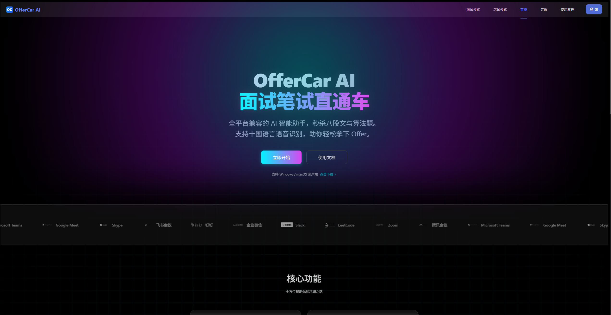
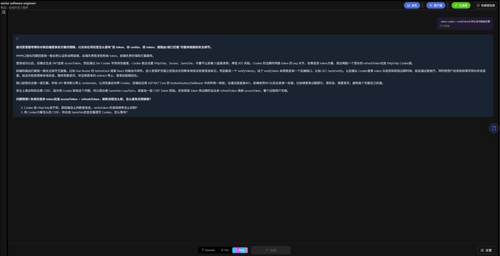

<div align="center">

<!-- Logo占位符 - 请替换为实际Logo -->


# OfferCar AI

**🚀 AI 驱动的智能面试笔试助手**

让 AI 成为你的求职教练，助你斩获心仪 Offer

[](https://github.com/a951273629/OfferCar/blob/main/LICENSE)
[](https://github.com/a951273629/OfferCar/stargazers)
[](https://github.com/a951273629/OfferCar/network/members)
[](https://github.com/a951273629/OfferCar/issues)
[](https://github.com/a951273629/OfferCar/pulls)

[](https://nextjs.org/)
[](https://reactjs.org/)
[](https://www.typescriptlang.org/)
[](https://ant.design/)
[](https://www.mysql.com/)

[🌐 在线体验](https://www.offercar.cn) · [📖 文档](#) · [🐛 报告问题](https://github.com/a951273629/OfferCar/issues) · [✨ 功能建议](https://github.com/a951273629/OfferCar/issues)

</div>

---

## 📋 目录

- [项目概述](#-项目概述)
- [核心特性](#-核心特性)
- [在线演示](#-在线演示)
- [屏幕截图](#-屏幕截图)
- [Star History](#-star-history)
- [快速开始](#-快速开始)
- [安装指南](#-安装指南)
- [环境配置](#-环境配置)
- [项目架构](#-项目架构)
- [技术栈](#️-技术栈)
- [使用文档](#-使用文档)
- [Docker 部署](#-docker-部署)
- [贡献指南](#-贡献指南)
- [许可证](#-许可证)
- [致谢](#-致谢)

---

##  项目概述

**OfferCar AI** 是一款基于人工智能技术的面试和笔试辅助平台，致力于帮助求职者通过真实场景模拟和智能反馈，系统性地提升面试表现和笔试能力，增强求职竞争力。

###  核心价值

- **真实场景模拟** - 高度还原企业面试流程，让您在安全环境中充分练习
- **智能实时反馈** - AI 评估系统即时分析表现，提供可操作的改进建议
- **持续进步跟踪** - 完整记录学习历程，可视化展示能力提升轨迹
- **灵活学习方式** - 支持语音交互和文字作答，适应不同学习偏好

---

##  核心特性

| 功能模块 | 功能描述 |
|---------|---------|
|  **AI 面试模式** | 模拟真实面试场景，AI 面试官实时提问和反馈，支持语音交互 |
|  **笔试练习** | 涵盖各类职位的笔试题目，支持多种题型和难度级别 |
|  **实时语音识别** | 基于 火山bytedance 高精度语音识别与转写 |
|  **智能评估** | AI 智能分析回答质量，提供专业的评分和改进建议 |
|  **会话持久化** | 面试和笔试记录自动保存，支持随时继续和回顾 |
|  **数据分析** | 可视化展示学习进度和能力模型，精准定位薄弱环节 |
|  **桌面客户端** | 提供 Electron 桌面应用，更好的隐私保护和离线支持 |
|  **WebRTC 实时通信** | 支持远程面试模拟，实时音视频交互 |

---

##  在线演示

 **立即体验**：[https://www.offercar.cn](https://www.offercar.cn)
 **在线文档**：[在线文档](https://www.offercar.cn/docs)
> 无需安装，即刻开始您的 AI 面试之旅！

<div align="center">
  <video width="100%" controls>
    <source src=".github/assets/demos/demo.mp4" type="video/mp4">
    您的浏览器不支持 HTML5 视频。
  </video>
  <p><em>AI 面试演示视频</em></p>
</div>

---

##  演示DEMO


### 主页

 📷 **门户页面**: 

### AI 面试模式

  **面试中**:  
 AI 面试官实时对话，语音识别和智能反馈界面


---

## ⭐ Star History

[](https://star-history.com/#a951273629/OfferCar&Date)

---

## 🚀 快速开始

### 前置要求

- **Node.js** >= 18.0.0
- **npm** >= 7.0.0
- **MySQL** >= 8.0
- **OpenAI API Key** 或 **Google Gemini API Key**

### 克隆项目

```bash
git clone [https://github.com/a951273629/OfferCar.git](https://github.com/a951273629/OfferCar.git)
cd OfferCar

### 安装依赖

# 安装所有子项目依赖
npm run install:all

# 或分别安装
cd web_client && npm install
cd ../webrtc_server && npm install
cd ../window_client && npm install

# 复制环境变量模板
cp .env.template .env

# 编辑 .env 文件，填入必要的配置
# 详见"环境配置"章节、、

### 初始化数据库
cd web_client
npm run init-db

# 方式1: 使用根目录脚本启动所有服务
npm run dev:web      # 启动 Web 客户端
npm run dev:webrtc   # 启动 WebRTC 信令服务器
npm run dev:electron # 启动 Electron 桌面客户端

# 方式2: 使用 Docker Compose（推荐生产环境）
docker-compose up -d